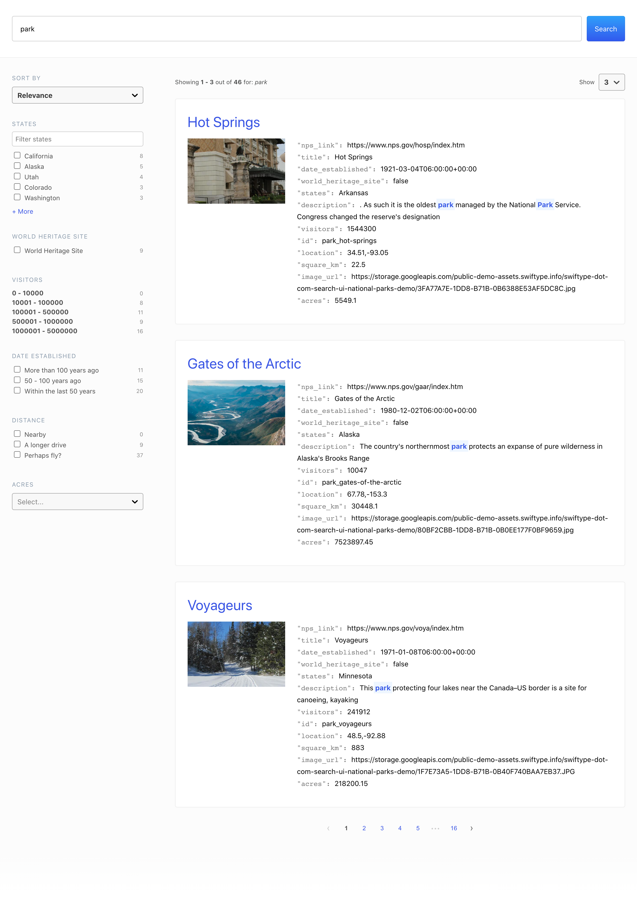

# [Elastic Search UI](https://docs.elastic.co/search-ui)

Search UI is a JavaScript search framework for implementing world-class search experiences without reinventing the wheel.

## Get started

To quickly get started with Search UI, follow one of our tutorials:

- [Search UI with Elastic App Search](https://docs.elastic.co/search-ui/tutorials/app-search)
- [Search UI with Elasticsearch](https://docs.elastic.co/search-ui/tutorials/elasticsearch)

## Documentation

Check out our [documentation site](https://docs.elastic.co/search-ui) which contains detailed guides for setting up and using Search UI.

## Contributing

We welcome contributors to the project. Follow our [contributing guide](./CONTRIBUTING.md) to get started.

## License 📗

[Apache-2.0](https://github.com/elastic/search-ui/blob/master/LICENSE.txt) © [Elastic](https://github.com/elastic)

Thank you to all the [contributors](https://github.com/elastic/search-ui/graphs/contributors)!
