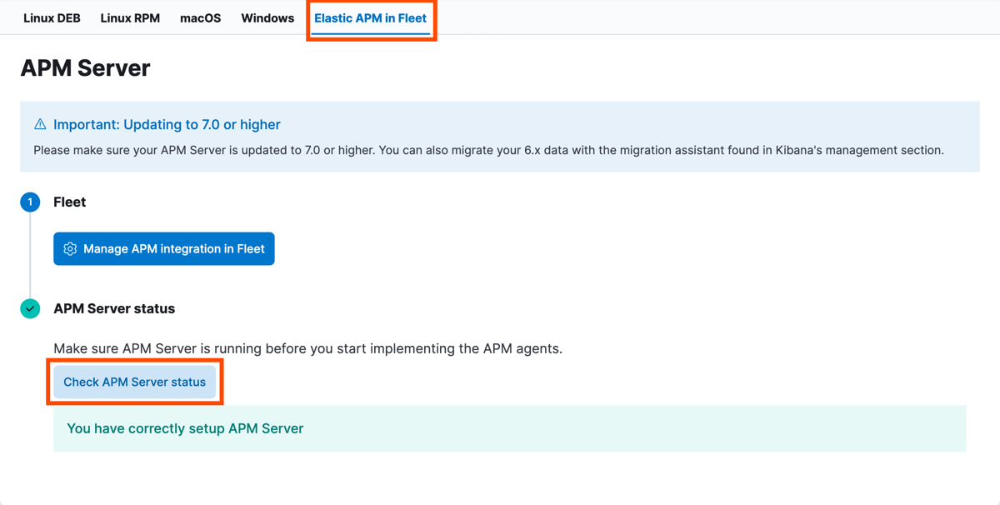
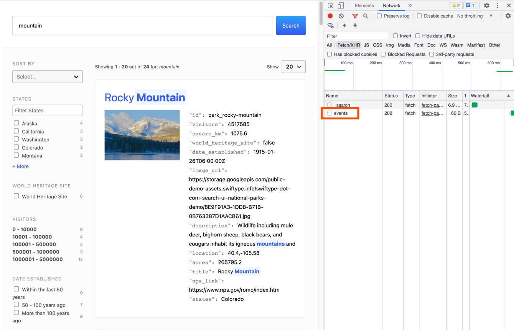

Search UI allows you to analyze the performance and track errors on your search page by using
[Elastic Real User Monitoring](https://www.elastic.co/observability/real-user-monitoring) (RUM).

APM RUM captures the following information:

- Page load metrics
- Load time of Static Assets (JS, CSS, images, fonts, etc.)
- API requests (XMLHttpRequest and Fetch)
- Single page application navigations
- User interactions (click events that trigger network activity)
- User-centric metrics (Long tasks, FCP, LCP, FID, etc.)
- Page information (URLs visited and referrer)
- Network connection information
- JavaScript errors
- Distributed tracing
- Breakdown metrics

## Setup

<DocCallOut title="">
  This guide assumes that you're using Elastic Cloud and want to analyze a React
  application. If your setup is different or you get stuck on any step, please
  refer to the main [APM RUM
  documentation](https://www.elastic.co/guide/en/apm/agent/rum-js/current/index.html).
</DocCallOut>

The setup process consists of three steps:

- Enabling Integrations Server
- Checking server status
- Adding APM RUM to your application

### Enabling Integrations Server

1. Open Elastic Cloud https://cloud.elastic.co
1. Find the deployment you want to add APM RUM to.
1. Click Edit deployment (⚙ icon).
1. On the deployment page click Edit in the left menu.
1. Find the Integrations Server section.
   - If you already have Integrations server enabled, go to the next step.
   - If don't — click "Add capacity" and choose the size of the server.

### Checking server status

1. Go to the main Kibana page of your deployment.
1. Click Observability.
1. On the Observability overview page, find and click the button "Install RUM Agent".
1. In the tab "Elastic APM in Fleet" find "Check APM Server status" button and click it. You should see a confirmation that APM Server is working.

### Adding APM RUM to your application

1. On the same page scroll down and find "RUM (JS)" tab and click it.
1. Copy the code snippet and paste it into your application. Put it before the react `.render()` call, so APM RUM would already be initialized when React starts rendering the application.
1. Update the `serviceName` to the name of your application.
1. Replace the value of `environment` field to `process.env.NODE_ENV` to separate analytics from development and production environments.
1. Add the APM RUM dependency to your application: `npm install @elastic/apm-rum`.
1. Check that the events are sent by opening your browser dev tools and looking at the network tab. You should see the events request being sent after each search request.

If you're using Search UI in a React application, it's recommended to also use the React integraton of APM RUM for more detailed analysis. Follow this guide for setting it up: https://www.elastic.co/guide/en/apm/agent/rum-js/current/react-integration.html

If you feel stuck, check out this PR as an example of adding APM RUM to a React application: https://github.com/elastic/search-ui/pull/764/files

---

That's it! Once the above steps are done, open the search page, do a couple searches to generate analytics events and head to Observability -> Dashboard to see your analytics data.
