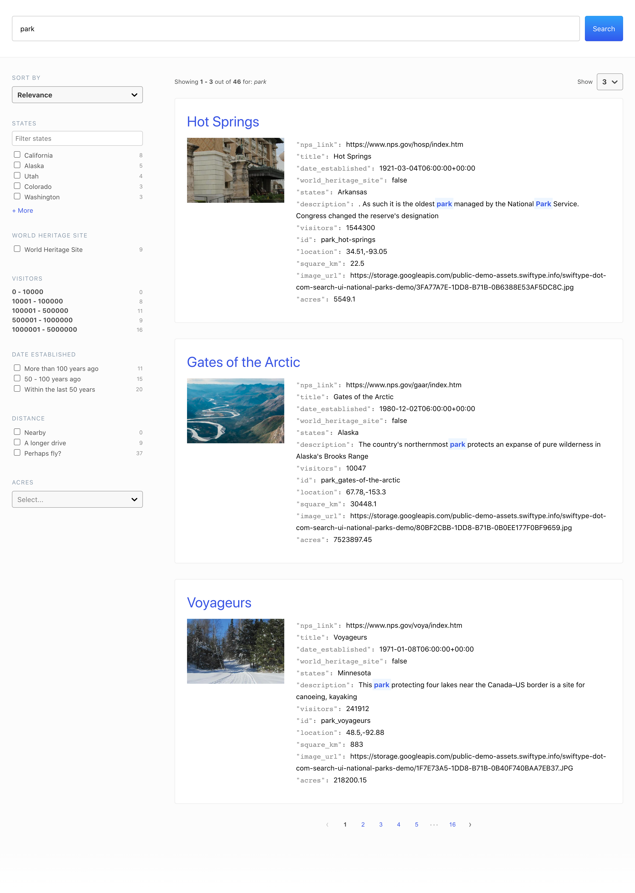

A [React](https://reactjs.org) library that allows you to quickly implement search experiences without re-inventing the wheel.

Use it with [Elastic](https://www.elastic.co/) to have a search experience up and running in minutes.

### Features 👍

- **You know, for search** - Maintained by [Elastic](https://elastic.co), the team behind Elasticsearch.
- **Speedy Implementation** - Build a complete search experience with a few lines of code.
- **Customizable** - Tune the components, markup, styles, and behaviors to your liking.
- **Smart URLs** - Searches, paging, filtering, and more, are captured in the URL for direct result linking.
- **Flexible front-end** - Not just for React. Use with any JavaScript library, even vanilla JavaScript.
- **Flexible back-end** - Use it with Elasticsearch, Elastic Enterprise Search, or any other search API.

### Live Demo

<iframe
  src="https://codesandbox.io/embed/github/elastic/search-ui/tree/stable/examples/sandbox?autoresize=1&fontsize=12&initialpath=%2Felasticsearch&module=%2Fsrc%2Fpages%2Felasticsearch%2Findex.js&theme=light&view=preview&hidedevtools=1"
  style={{
    width: "100%",
    height: "800px",
    overflow: "hidden"
  }}
  title="Search UI"
  allow="accelerometer; ambient-light-sensor; camera; encrypted-media; geolocation; gyroscope; hid; microphone; midi; payment; usb; vr; xr-spatial-tracking"
  sandbox="allow-forms allow-modals allow-popups allow-presentation allow-same-origin allow-scripts"
></iframe>

## FAQ 🔮

### Is Search UI only for React?

Nope. Search UI is "headless".

You can write support for it into any JavaScript framework. You can even use vanilla JavaScript.

[Read about the search-ui package](https://github.com/elastic/search-ui/tree/master/packages/search-ui) for more information, or check out the [Vue.js Example](https://github.com/elastic/vue-search-ui-demo).

### Can I use my own styles?

You can!

Read the <DocLink id="guides-customizing-styles-and-html" text="Custom Styles and Layout Guide" /> to learn more, or check out the [Seattle Indies Expo Demo](https://github.com/elastic/seattle-indies-expo-search).

### Can I build my own Components?

Yes! Absolutely.

Check out the <DocLink id="guides-creating-your-own-components" text="Build Your Own Component Guide" />.

### Does Search UI only work with App Search?

Nope! We do have two first party connectors: Site Search and App Search.

But Search UI is headless. You can use _any_ Search API.

Read the <DocLink id="connectors-api-custom-connector" /> to learn more about building your own connector for your API.

### How do I use this with Elasticsearch?

Read the <DocLink id="connectors-api-elasticsearch" text="Elasticsearch Connector" /> docs.

### Where do I report issues with the Search UI?

If something is not working as expected, please open an [issue](https://github.com/elastic/search-ui/issues/new).

### Where can I go to get help?

The Enterprise Search team at Elastic maintains this library and are happy to help. Try posting your question to the [Elastic Enterprise Search](https://discuss.elastic.co/c/enterprise-search/84) discuss forums. Be sure to mention that you're using Search UI and also let us know what backend your using; whether it's App Search, Site Search, Elasticsearch, or something else entirely.

## Contribute 🚀

We welcome contributors to the project. Before you begin, a couple notes...

- Read the [Search UI Contributor's Guide](https://github.com/elastic/search-ui/blob/master/CONTRIBUTING.md).
- Prior to opening a pull request, please:
  - Create an issue to [discuss the scope of your proposal](https://github.com/elastic/search-ui/issues).
  - Sign the [Contributor License Agreement](https://www.elastic.co/contributor-agreement/). We are not asking you to assign copyright to us, but to give us the right to distribute your code without restriction. We ask this of all contributors in order to assure our users of the origin and continuing existence of the code. You only need to sign the CLA once.
- Please write simple code and concise documentation, when appropriate.

## License 📗

[Apache-2.0](https://github.com/elastic/search-ui/blob/master/LICENSE.txt) © [Elastic](https://github.com/elastic)

Thank you to all the [contributors](https://github.com/elastic/search-ui/graphs/contributors)! 🙏 🙏
