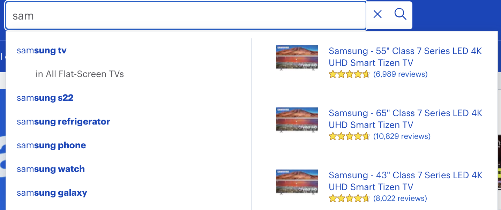
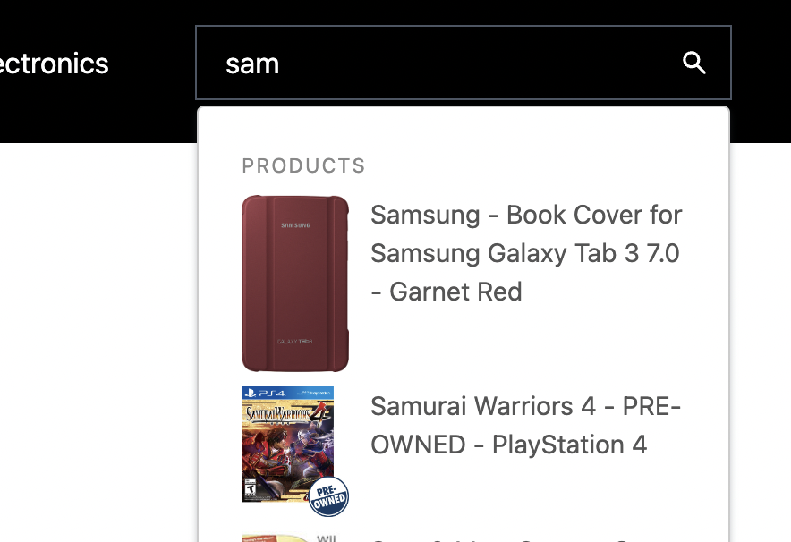
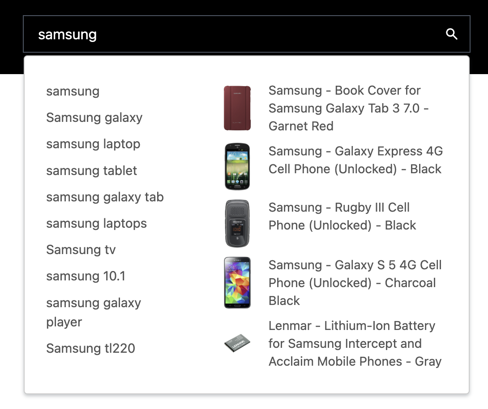

---
mapped_pages:
  - https://www.elastic.co/guide/en/search-ui/current/solutions-ecommerce-autocomplete.html
applies_to:
  stack:
  serverless:
---

# Autocomplete [solutions-ecommerce-autocomplete]

When you start typing in a search box on ecommerce sites like Amazon or Best Buy, you might have seen a dropdown showing suggestions to try next. This is called autocomplete.

% TO DO: Use `:class: screenshot`


On some of the more popular ecommerce sites, you may see suggestions in the form of search suggestions, product categories, and products.

% TO DO: Use `:class: screenshot`


This article will discuss how to implement an autocomplete search box that provides multiple options on your ecommerce site.

Search UI can be used to provide different types of suggestions from multiple sources. For example, depending on your use case, you can display query suggestions, products from the product catalog, and a list of popular queries at the same time.

:::{tip}
Test out the examples from this article in our [interactive CodeSandbox demo](https://codesandbox.io/embed/github/elastic/search-ui/tree/main/examples/sandbox?autoresize=1&fontsize=12&initialpath=%2Fecommerce&module=%2Fsrc%2Fpages%2Fecommerce%2Findex.jsx) - try searching for "monitor" to see it in action!
:::

## Before you begin [solutions-ecommerce-autocomplete-before-you-begin]

This tutorial builds on the [searchbox autocomplete documentation](/reference/api-react-components-search-box.md).

## Integrating the Searchbox [solutions-ecommerce-autocomplete-integrating-the-searchbox]

Typically ecommerce sites have a search bar within the site’s header, which is accessible on every page.

For this tutorial, we will assume that the search bar is located in the site’s header.

Within the header, we need to use the `SearchProvider` and `Searchbox` components to integrate the autocomplete search box.

```jsx
const config = {
  // search provider configuration for autocomplete
};

function NavigationHeader() {
  return (
    <div>
      <ComponyLogo />
      <BrowseNavigationLinks />
      <SearchProvider
        config={{
          ...config,
          trackUrlState: false
        }}
      >
        <SearchBox
          onSubmit={(searchTerm) => {
            window.location.href = `${PATH_TO_YOUR_SEARCH_PAGE}?q=${searchTerm}`;
          }}
        />
      </SearchProvider>
      <UserProfile />
    </div>
  );
}
```

Should you find the search bar markup too limiting to your needs, you can override the display using the optional `inputView` `autocompleteView` and `resultsView` props.

```jsx
<SearchBox
  autocompleteView={({ autocompletedResults, getItemProps }) => (
    <div className="sui-search-box__autocomplete-container">
      {autocompletedResults.map((result, i) => (
        <div
          {...getItemProps({
            key: result.id.raw,
            item: result
          })}
          className="flex"
        >
          Result {i}: {result.title.snippet}
        </div>
      ))}
    </div>
  )}
/>
```

For more information of whats possible to customise, see [searchbox autocomplete documentation](/reference/api-react-components-search-box.md).

## Term Suggestions [solutions-ecommerce-autocomplete-term-suggestions]

Term Suggestions help the customer quickly type in the search term. The suggestions are based on keywords that are already present in the index. To do this, you need:

- An engine or index populated with products

To configure the SearchBox to provide suggestions based on keywords, you need to pass a `config` object to the `SearchProvider` component and configure the `Searchbox autocompleteSuggestions` to be true.

% TO DO: Use `:class: screenshot`


Example Code

:::::::{tab-set}

::::::{tab-item} Configuration

```jsx
const config = {
  autocompleteQuery: {
    resultsPerPage: 5,
    result_fields: {
      name: { snippet: { size: 100, fallback: true } },
      url: { raw: {} }
    },
    search_fields: {
      name_product_autocomplete: {}
    }
  }
};
```

::::::

::::::{tab-item} Searchbox Component

```jsx
<SearchBox
  autocompleteResults={{
    titleField: "name",
    urlField: "url"
  }}
/>
```

::::::

:::::::

## Product Suggestions [solutions-ecommerce-autocomplete-product-suggestions]

With this feature, products will be presented as suggestions to the customer. When the customer clicks on the product suggestion, they will be navigated straight to the product’s detail page.

% TO DO: Use `:class: screenshot`


First, we specify the `autocompleteQuery.results` configuration:

:::::::{tab-set}

::::::{tab-item} Configuration

```jsx
const config = {
  alwaysSearchOnInitialLoad: false,
  autocompleteQuery: {
    results: {
      resultsPerPage: 5,
      result_fields: {
        // specify the fields you want from the index to display the results
        image: { raw: {} },
        name: { snippet: { size: 100, fallback: true } },
        url: { raw: {} }
      },
      search_fields: {
        // specify the fields you want to search on
        name: {}
      }
    }
  },
  apiConnector: connector
};
```

::::::

::::::{tab-item} Searchbox Component

```jsx
<SearchBox
  autocompleteResults={{
    titleField: "name",
    urlField: "url"
  }}
  autocompleteView={AutocompleteView}
/>
```

::::::

::::::{tab-item} Autocomplete View Component

````jsx
  function AutocompleteView({
    autocompleteResults,
    autocompletedResults,
    autocompleteSuggestions,
    autocompletedSuggestions,
    className,
    getItemProps,
    getMenuProps
  }) {
    let index = 0;
    return (
      <div
        {...getMenuProps({
          className: ["sui-search-box__autocomplete-container", className].join(
            " "
          )
        })}
      >
        <>
          {!!autocompleteSuggestions &&
            Object.entries(autocompletedSuggestions).map(
              ([suggestionType, suggestions]) => {
                return (
                  <React.Fragment key={suggestionType}>
                    {getSuggestionTitle(
                      suggestionType,
                      autocompleteSuggestions
                    ) &&
                      suggestions.length > 0 && (
                        <div className="sui-search-box__section-title">
                          {getSuggestionTitle(
                            suggestionType,
                            autocompleteSuggestions
                          )}
::::::

:::::::

## Suggestions from another source index [solutions-ecommerce-autocomplete-suggestions-from-another-source-index]

::::{important}
**Requires Elasticsearch Connector.**

::::


Sometimes you want to display suggestions from a different index than the one you use for search. For example, you might want to show suggestions from a `popular_queries` or a `designers` index. Search UI supports this within the `autocompleteSuggestions` configuration.

In this example, we will populate an index with popular queries. The mapping and example documents for the index will be as follows:

:::::::{tab-set}

::::::{tab-item} Mapping
```json
{
  "popular_queries" : {
      "mappings" : {
        "properties" : {
          "name" : {
            "type" : "text",
            "fields" : {
              "suggest" : {
              "type" : "search_as_you_type",
              "doc_values" : false,
              "max_shingle_size" : 3
              }
            }
          }
        }
      }
    }
}
````

::::::

::::::{tab-item} Example Document

```json
{
  "name": "Iphone 4s"
}
```

::::::

:::::::
Next, setup Search UI `Searchbox` and `configuration` to display suggestions from the `popular_queries` index.

:::::::{tab-set}

::::::{tab-item} Search Configuration

```jsx
const config = {
  alwaysSearchOnInitialLoad: false,
  autocompleteQuery: {
    suggestions: {
      types: {
        popularQueries: {
          search_fields: {
            "name.suggest": {} // fields used to query
          },
          result_fields: {
            name: {
              raw: {}
            }
          },
          index: "popular_queries",
          queryType: "results"
        }
      },
      size: 4
    }
  },
  apiConnector: connector
};
```

::::::

::::::{tab-item} Searchbox Component Configuration

```jsx
<SearchBox
  autocompleteSuggestions={{
    popularQueries: {
      sectionTitle: "Popular queries",
      queryType: "results",
      displayField: "name"
    }
  }}
/>
```

::::::

:::::::
Now, when you type `was` in the SearchBox, the autocomplete view will display the popular queries:

% TO DO: Use `:class: screenshot`


If you want to display more fields from the index, you can use the `result_fields` configuration and implement a custom `autocompleteView` to display these fields.

## Suggestions from multiple sources [solutions-ecommerce-autocomplete-suggestions-from-multiple-sources]

Combining the suggestion configurations above allows you to display suggestions from multiple sources simultaneously.

% TO DO: Use `:class: screenshot`


To do this, extend the `autocompleteQuery` configuration to specify multiple sources. For example, in the screenshot above, we customized the `autocompleteView` CSS to display the popular queries and the results from the `autocompleteSuggestions` configuration side by side and hide the section titles.

:::::::{tab-set}

::::::{tab-item} Search Configuration

```jsx
const config = {
  alwaysSearchOnInitialLoad: false,
  autocompleteQuery: {
    suggestions: {
      types: {
        popularQueries: {
          search_fields: {
            "name.suggest": {} // fields used to query
          },
          result_fields: {
            name: {
              raw: {}
            }
          },
          index: "popular_queries",
          queryType: "results"
        }
      },
      size: 4
    }
  },
  apiConnector: connector
};
```

::::::

::::::{tab-item} Searchbox Component Configuration

```jsx
<SearchBox
  autocompleteResults={{
    sectionTitle: "Products",
    titleField: "name",
    urlField: "url"
  }}
  autocompleteSuggestions={{
    popularQueries: {
      sectionTitle: "Popular queries",
      queryType: "results",
      displayField: "name"
    }
  }}
/>
```

::::::

:::::::

## Related Articles [solutions-ecommerce-autocomplete-related-articles]

- [Adding search bar to header](/reference/guides-adding-search-bar-to-header.md)
- [React components](/reference/api-react-components-search-box.md)
- [Changing component behavior](/reference/guides-changing-component-behavior.md)
