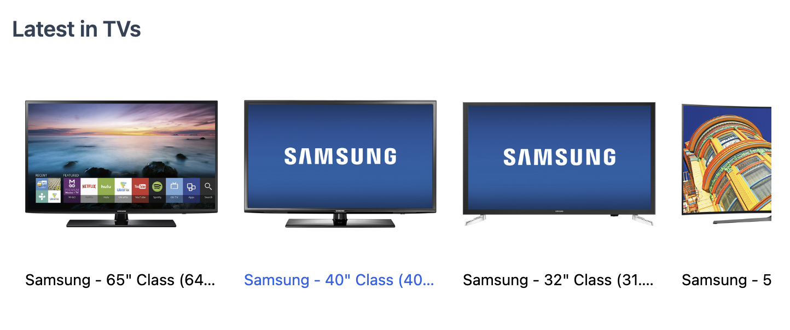

---
mapped_pages:
  - https://www.elastic.co/guide/en/search-ui/current/solutions-ecommerce-carousel.html
---

# Product Carousels [solutions-ecommerce-carousel]

:::{warning}
This example uses the App Search connector, which is now deprecated and will no longer be supported. Please use [Elasticsearch Connector](/reference/api-connectors-elasticsearch.md).
:::

Carousels can be used to show groups of products into a row and are typically used to show products within a specific category or tag, like "most popular", "best rated" and "on sale".

In this example, we show a carousel of products within the "TVs" category using the `Results` component and overriding the `view`.

You can adjust the number of results returned via the `resultsPerPage` configuration.

% TO DO: Use `:class: screenshot`


:::::::{tab-set}

::::::{tab-item} Component

````jsx
  import { Results, SearchProvider } from "@elastic/react-search-ui";
  import { config } from "./config";

  const CustomResultsView = ({ children }) => {
    return (
      <div className="relative overflow-x-auto">
        <ul className="flex snap-x">{children}</ul>
::::::

::::::{tab-item} Search UI Config
```js
import AppSearchAPIConnector from "@elastic/search-ui-app-search-connector";

const connector = new AppSearchAPIConnector({
searchKey: "<search-key>",
engineName: "<engine-name>",
endpointBase: "<endpoint-base>",
});

export const config = () => ({
  alwaysSearchOnInitialLoad: true,
  trackUrlState: false,
  initialState: {
    resultsPerPage: 8
  },
  searchQuery: {
    filters: [{ field: "parent_category", values: ["TVs"] }],
    result_fields: {
      name: {
        raw: {}
      },
      image: { raw: {} },
      url: { raw: {} }
    }
  },
  apiConnector: connector
});
````

::::::

:::::::

:::{tip}
[Try the demo in CodeSandbox](https://codesandbox.io/embed/github/elastic/search-ui/tree/main/examples/sandbox?autoresize=1&fontsize=12&initialpath=%2Fecommerce&module=%2Fsrc%2Fpages%2Fecommerce%2Findex.js).
:::

- [Creating Components](/reference/guides-creating-own-components.md): Build your own components for Search UI.
- [Results](/reference/api-react-components-results.md): Search UI React Results Component.
- [Core API](/reference/api-core-configuration.md): Search UI Configuration API.
