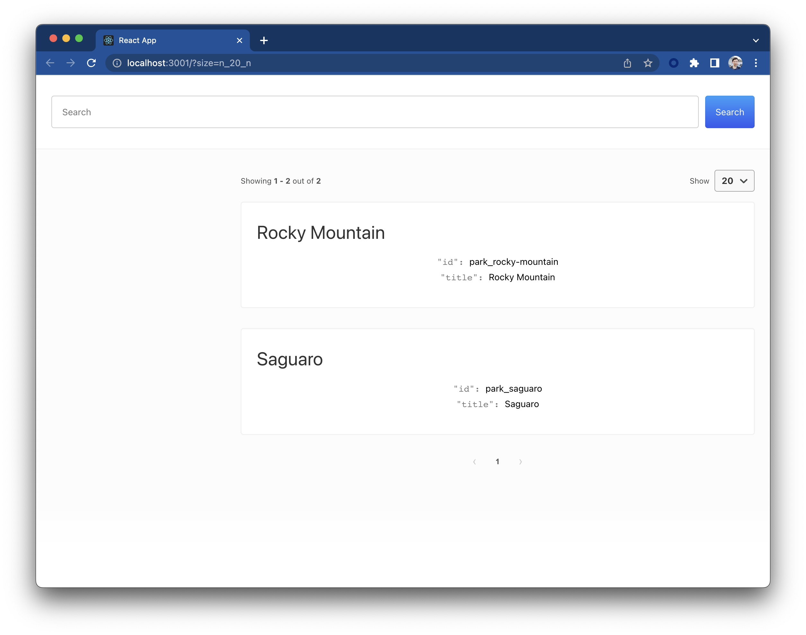

This tutorial will guide you through the process of creating a Search UI with App Search, using the app search connector. We will be using a sample US parks data-set.

Within this tutorial, we assume that you have node.js installed on your machine.

## Step 1: Setup App Search

First we need to setup App Search. The easiest way to do this is to use the Elastic's Cloud to create an App Search deployment. You can signup for an App Search deployment [here](https://cloud.elastic.co/registration).

Once App Search has been setup, navigate to App Search in Kibana. You should be able to see a link to Enterprise Search from the home menu.


Then next navigate to App Search and start to create your engine that will hold our us parks records.


### Setup Engine

Add a name for the engine. Here we have chosen "us-parks".


### Index Data

Once we have created an engine, we need to index our data. We will be using the [US Parks dataset](https://www.us-parks.org/dataset/). To do this, we use the "Paste JSON" option and App search has provided a sample dataset.

```json
{
  "id": "park_rocky-mountain",
  "title": "Rocky Mountain",
  "description": "Bisected north to south by the Continental Divide, this portion of the Rockies has ecosystems varying from over 150 riparian lakes to montane and subalpine forests to treeless alpine tundra. Wildlife including mule deer, bighorn sheep, black bears, and cougars inhabit its igneous mountains and glacial valleys. Longs Peak, a classic Colorado fourteener, and the scenic Bear Lake are popular destinations, as well as the historic Trail Ridge Road, which reaches an elevation of more than 12,000 feet (3,700 m).",
  "nps_link": "https://www.nps.gov/romo/index.htm",
  "states": ["Colorado"],
  "visitors": 4517585,
  "world_heritage_site": false,
  "location": "40.4,-105.58",
  "acres": 265795.2,
  "square_km": 1075.6,
  "date_established": "1915-01-26T06:00:00Z"
}
```


### Field Schema

App Search will infer the data types for each field based on the data. We can also manually configure the data types for each field.

To do this, we go to the `Schema` section of the engine.


Here we have adjusted a number of fields from their default `text` field type:

- visitors to be a number
- square_km to be a number
- date_established to be a date
- location to be a geolocation
- acres to be a number

Adjusting the field type allows us to use different queries and facet filters only applicable to the data types we are using.

### API Keys

API keys are used to access the engine. By default, there are two key types available:

- private-key: This is the key that is used to read and write to the engine.
- search-key: This is the key that has read only access to the engine.


For this example, we are going to use the search-key. By default the search-key has been created. To use it, we must copy the key. Keep this key safe, we will be using it later on.

Also above is the host url. Copy this as we will use this later on too.

## Step 2: Building a Search UI

For this tutorial, we are going to be using the popular [Create React App (CRA) framework](https://reactjs.org/docs/create-a-new-react-app.html). To get started, we run the following command

```shell
npx create-react-app us-parks-demo
```

Once this has been completed, we can navigate to the directory of the project.

### Install Search UI dependencies

Now we need to install the dependencies for the search UI into our project. We can do this by running the following command:

```shell
yarn add @elastic/search-ui @elastic/react-search-ui-views @elastic/search-ui-app-search-connector @elastic/react-search-ui
```

This will download the latest version of the packages and install them into our project.

### Add Search UI React Components

We can now add the Search UI React components to our project. First we need to open the `src/App.js` file and add the following:

```js
import AppSearchAPIConnector from "@elastic/search-ui-app-search-connector";
import React from "react";
import {
  ErrorBoundary,
  Facet,
  SearchProvider,
  SearchBox,
  Results,
  PagingInfo,
  ResultsPerPage,
  Paging,
  Sorting,
  WithSearch
} from "@elastic/react-search-ui";
import {
  BooleanFacet,
  Layout,
  SingleLinksFacet,
  SingleSelectFacet
} from "@elastic/react-search-ui-views";
import "@elastic/react-search-ui-views/lib/styles/styles.css";

const connector = new AppSearchAPIConnector({
  searchKey: "<your-api-key>",
  engineName: "us-parks",
  endpointBase: "<your-host-url>"
});

const config = {
  debug: true,
  alwaysSearchOnInitialLoad: true,
  apiConnector: connector,
  hasA11yNotifications: true,
  searchQuery: {
    result_fields: {
      title: { raw: {} }
    },
    search_fields: {},
    disjunctiveFacets: [""],
    facets: {}
  }
};

export default function App() {
  return (
    <SearchProvider config={config}>
      <WithSearch
        mapContextToProps={({ wasSearched }) => ({
          wasSearched
        })}
      >
        {({ wasSearched }) => {
          return (
            <div className="App">
              <ErrorBoundary>
                <Layout
                  header={<SearchBox debounceLength={0} />}
                  sideContent={<div></div>}
                  bodyContent={
                    <Results
                      titleField="title"
                      urlField="nps_link"
                      thumbnailField="image_url"
                      shouldTrackClickThrough
                    />
                  }
                  bodyHeader={
                    <React.Fragment>
                      {wasSearched && <PagingInfo />}
                      {wasSearched && <ResultsPerPage />}
                    </React.Fragment>
                  }
                  bodyFooter={<Paging />}
                />
              </ErrorBoundary>
            </div>
          );
        }}
      </WithSearch>
    </SearchProvider>
  );
}
```

Lets check that the app works by running the following command:

```shell
yarn start
```

Hopefully you now have a working search UI, something similar to below.



## Step 5: Setup configuration

We have a working search UI, but we need to configure it now to use the data we have. Lets start by identifying which fields we want to search, display and be a facet.

Here is the data that we have indexed:

```json
{
  "id": "park_rocky-mountain",
  "title": "Rocky Mountain",
  "description": "Bisected north to south by the Continental Divide, this portion of the Rockies has ecosystems varying from over 150 riparian lakes to montane and subalpine forests to treeless alpine tundra. Wildlife including mule deer, bighorn sheep, black bears, and cougars inhabit its igneous mountains and glacial valleys. Longs Peak, a classic Colorado fourteener, and the scenic Bear Lake are popular destinations, as well as the historic Trail Ridge Road, which reaches an elevation of more than 12,000 feet (3,700 m).",
  "nps_link": "https://www.nps.gov/romo/index.htm",
  "states": ["Colorado"],
  "visitors": 4517585,
  "world_heritage_site": false,
  "location": "40.4,-105.58",
  "acres": 265795.2,
  "square_km": 1075.6,
  "date_established": "1915-01-26T06:00:00Z"
}
```

and the fields that we want to be:

Searchable: title, description, states
Displayable: title, description, states, visitors, acres, square_km, date_established, nps_link
Facetable: states, visitors, acres, square_km, date_established

### Searchable Configuration

We want title, description, and states to be searchable. We can do this by adding the following to the `config` object:

```js
  search_fields: {
    title: {
      weight: 5
    },
    description: {},
    states: {}
  }
```

The weight is the weight of the field. The higher the weight, the more important the field is.

### Displayble Configuration

We want title, description, states, visitors, acres, square_km, nps_link and date_established to be displayable. We can do this by adding the following to the `config` object:

```js
  result_fields: {
  title: {
    snippet: {
      fallback: true
    }
  },
  description: {
    snippet: {
      fallback: true
    }
  },
  states: {
    snippet: {
      fallback: true
    }
  },
  visitors: { raw: {} },
  acres: { raw: {} },
  square_km: { raw: {} },
  date_established: { raw: {} },
  nps_link: { raw: {} },
}
```

Snippet is a configuration for the display of the field. Any value that matches a field will be displayed in the results as a highlight. The fallback will be used if a highlight is not found.

### Facetable Configuration

We want states, visitors, acres, square_km, and date_established to be facetable. We can do this by adding the following to the `config` object:

Below is an example of a variety of facet types, including:

- value facet: displays a list of filters aggregated by their counts
- range facet: displays a list of range filters (both numeric and date) aggregated by their counts
- geo-location facet: geo distance filters based on a location

```js
facets: {
  states: { type: "value", size: 30 },
  acres: {
    type: "range",
    ranges: [
      { from: -1, name: "Any" },
      { from: 0, to: 1000, name: "Small" },
      { from: 1001, to: 100000, name: "Medium" },
      { from: 100001, name: "Large" }
    ]
  },
  location: {
    // San Francisco. In the future, make this the user's current position
    center: "37.7749, -122.4194",
    type: "range",
    unit: "mi",
    ranges: [
      { from: 0, to: 100, name: "Nearby" },
      { from: 100, to: 500, name: "A longer drive" },
      { from: 500, name: "Perhaps fly?" }
    ]
  },
  date_established: {
    type: "range",

    ranges: [
      {
        from: '1972-04-13T12:48:33.420Z',
        name: "Within the last 50 years"
      },
      {
        from: '1922-04-13T12:48:33.420Z',
        to: '1972-04-13T12:48:33.420Z',
        name: "50 - 100 years ago"
      },
      {
        to: '1922-04-13T12:48:33.420Z',
        name: "More than 100 years ago"
      }
    ]
  },
  visitors: {
    type: "range",
    ranges: [
      { from: 0, to: 10000, name: "0 - 10000" },
      { from: 10001, to: 100000, name: "10001 - 100000" },
      { from: 100001, to: 500000, name: "100001 - 500000" },
      { from: 500001, to: 1000000, name: "500001 - 1000000" },
      { from: 1000001, to: 5000000, name: "1000001 - 5000000" },
      { from: 5000001, to: 10000000, name: "5000001 - 10000000" },
      { from: 10000001, name: "10000001+" }
    ]
  }
}
```

For these facets to appear, we need to add the facet components

```jsx
sideContent={
  <div>
    <Facet
      field="states"
      label="States"
      filterType="any"
      isFilterable={true}
    />
    <Facet
      field="world_heritage_site"
      label="World Heritage Site?"
      view={BooleanFacet}
    />
    <Facet
      field="visitors"
      label="Visitors"
      view={SingleLinksFacet}
    />
    <Facet
      field="date_established"
      label="Date Established"
      filterType="any"
    />
    <Facet
      field="location"
      label="Distance"
      filterType="any"
    />
    <Facet
      field="acres"
      label="Acres"
      view={SingleSelectFacet}
    />
  </div>
}
```

## Step 6: Test Drive!

You should be able to see the results of your search like below:


## Next Steps

Lets recap of the steps we have covered:

- We created an App Search Engine and indexed a sample data set of us-parks
- We configured the engine's schema and fields
- We created a new React project and added the Search UI components
- We configured the search UI to search the engine and display facets to help the user narrow down the results

Next you can add more data into the index, <DocLink id="guides-customizing-styles-and-html" section="results-component" text="update the results view to display more fields" />, and deploy the app.
