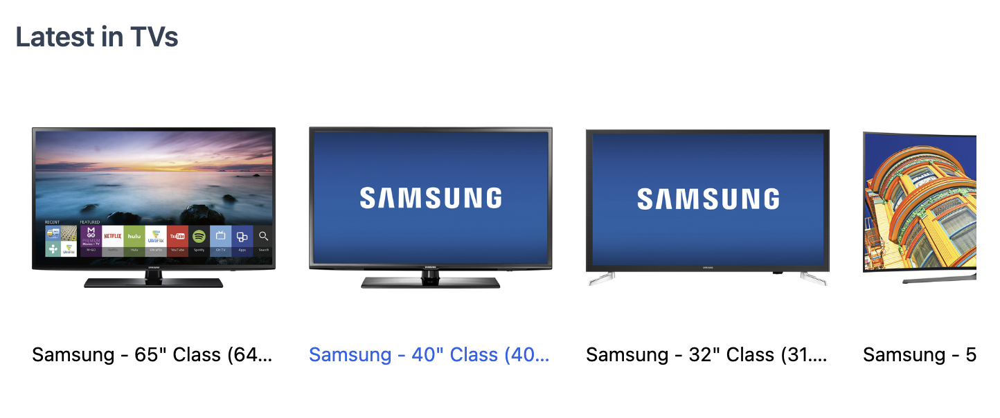

Carousels can be used to show groups of products into a row and are typically used to show products within a specific category or tag, like "most popular", "best rated" and "on sale".

In this example, we show a carousel of products within the "TVs" category using the `Results` component and overriding the `view`.

You can adjust the number of results returned via the `resultsPerPage` configuration.



<DocTabs>
  <DocTab name="Component">
    ```jsx
      import { Results, SearchProvider } from "@elastic/react-search-ui";
      import { config } from "./config";

      const CustomResultsView = ({ children }) => {
        return (
          <div className="relative overflow-x-auto">
            <ul className="flex snap-x">{children}</ul>
          </div>
        );
      };

      const CustomResultView = ({ result }) => {
        return (
          <li
            className="py-3 px-3 snap-start hover:text-blue-600"
            style={{ width: "200px" }}
          >
            <a href={result.url.raw}>
              
              <h4 className="text-sm truncate">{result.name.raw}</h4>
            </a>
          </li>
        );
      };

      export default function ProductCarousel(props) {
        return (
          <SearchProvider config={config}>
            <div className="product-carousel mb-10">
              <h3 className="text-xl leading-8 font-semibold text-slate-700">
                {props.title}
              </h3>
              <Results view={CustomResultsView} resultView={CustomResultView} />
            </div>
          </SearchProvider>
        );
      }

    ```

  </DocTab>
  <DocTab name="Search UI Config">
```js
import AppSearchAPIConnector from "@elastic/search-ui-app-search-connector";

const connector = new AppSearchAPIConnector({
searchKey: "<search-key>",
engineName: "<engine-name>",
endpointBase: "<endpoint-base>",
});

export const config = () => ({
  alwaysSearchOnInitialLoad: true,
  trackUrlState: false,
  initialState: {
    resultsPerPage: 8
  },
  searchQuery: {
    filters: [{ field: "parent_category", values: ["TVs"] }],
    result_fields: {
      name: {
        raw: {}
      },
      image: { raw: {} },
      url: { raw: {} }
    }
  },
  apiConnector: connector
});
```
  </DocTab>
</DocTabs>

<iframe
  src="https://codesandbox.io/embed/github/elastic/search-ui/tree/main/examples/sandbox?autoresize=1&fontsize=12&initialpath=%2Fecommerce&module=%2Fsrc%2Fpages%2Fecommerce%2Findex.js&theme=light&view=preview&hidedevtools=1"
  style={{
    width: "100%",
    height: "800px",
    overflow: "hidden"
  }}
  title="Search UI"
  allow="accelerometer; ambient-light-sensor; camera; encrypted-media; geolocation; gyroscope; hid; microphone; midi; payment; usb; vr; xr-spatial-tracking"
  sandbox="allow-forms allow-modals allow-popups allow-presentation allow-same-origin allow-scripts"
></iframe>

<DocRelatedArticles
  sectionTitle="Related Articles"
  items={[
    {
      slug: "/search-ui/guides/creating-your-own-components"
    },
    {
      slug: "/search-ui/api/react/components/results"
    },
    {
      slug: "/search-ui/api/core/configuration"
    }
  ]}
/>
