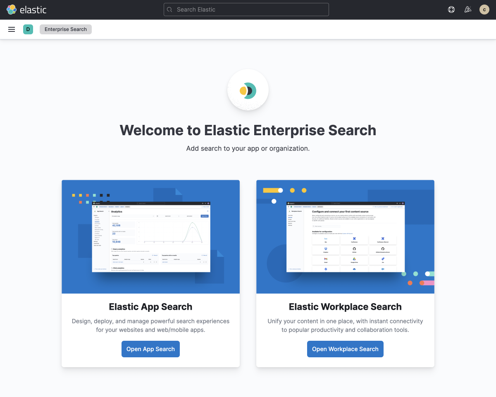
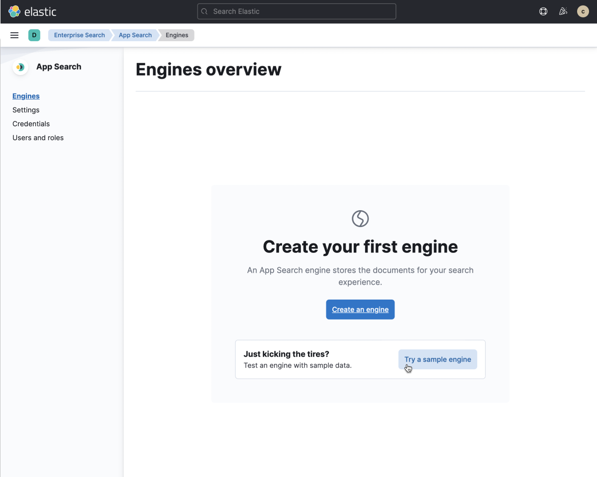
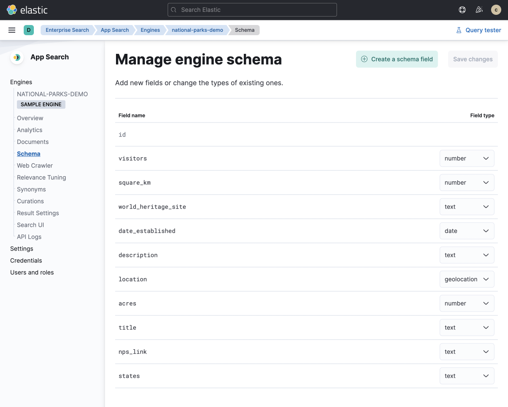
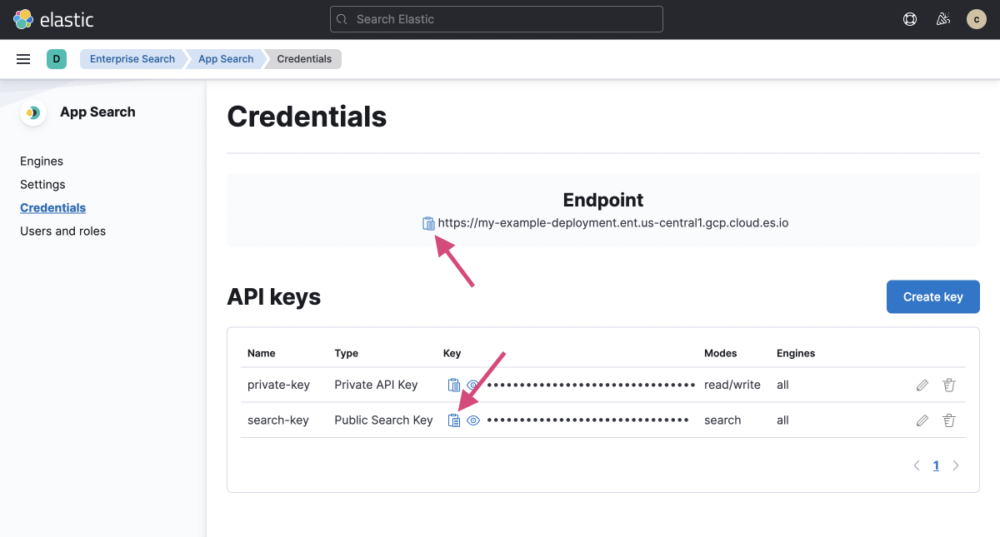

This tutorial will guide you through the process of creating a Search UI with [App Search](https://elastic.co/app-search), using the `search-ui-app-search-connector`. We will be using a sample engine in App Search, which comes pre-loaded with A US national parks dataset.

Within this tutorial, we assume that you have Node.js installed on your machine.

## Setup App Search

First we need to setup App Search, which is a part of [Elastic Enterprise Search](https://elastic.co/enterprise-search). The easiest way to do this is to create a deployment on [Elastic Cloud](https://elastic.co/cloud). You can sign up for a free 14-day trial [here](https://cloud.elastic.co/register), no credit card required.

Once your deployment has been created, navigate to Enterprise Search in Kibana. You should be able to see a link to Enterprise Search from the home menu.




In the next step, we'll navigate to App Search and create an engine that will hold our US national parks documents.

## Create an Engine with Sample Data

Select "Try a sample engine", which creates a engine loaded with useful sample data. The sample engine will be pre-loaded with the US national parks dataset that we'll need for our search experience. Easy!



### Configure Schema

Once our sample engine has been created, the next step is to inspect our engine's schema. By default, App Search will choose the field type "text" for each field, but we can manually configure the field types to match the type of data each field represents — text, date, geolocation, or number. **For the sample engine, the fields have been pre-configured for us.**



If you inspect the schema, you'll notice that a number of fields have been changed from their default `text` field type:

- `visitors` to be a **number**
- `square_km` to be a **number**
- `date_established` to be a **date**
- `location` to be a **geolocation**
- `acres` to be a **number**

Adjusting the field type allows us to use different queries, facets, and filters only applicable to the field types we are using. [Learn more about App Search schemas](https://www.elastic.co/guide/en/app-search/current/indexing-documents-guide.html#indexing-documents-guide-schema)

### API Keys

API keys are used to access the engine. By default, there are two key types available:

- private-key: This is the key that is used to read and write to the engine.
- search-key: This is the key that has read only access to the engine.



For this example, we are going to use the search-key. By default the search-key has been created. To use it, we must copy the key. Keep this key safe, we will be using it later on.

Also above is the host url. Copy this as we will use it later on as well.

## Build a Search Experience with Search UI

For this tutorial, we are going to be using the popular [Create React App (CRA) framework](https://reactjs.org/docs/create-a-new-react-app.html). To get started, we run the following command

```shell
npx create-react-app us-parks-demo
```

Once this has been completed, we can navigate to the directory of the project.

### Install Search UI dependencies

Now we need to install the dependencies for the search UI into our project. We can do this by running the following command:

```shell
yarn add @elastic/search-ui @elastic/react-search-ui-views @elastic/search-ui-app-search-connector @elastic/react-search-ui
```

This will download the latest version of the packages and install them into our project.

### Add Search UI React Components

We can now add the Search UI React components to our project. First we need to open `src/App.js` and replace it's contents with the following:

```js
import AppSearchAPIConnector from "@elastic/search-ui-app-search-connector";
import React from "react";
import {
  ErrorBoundary,
  Facet,
  SearchProvider,
  SearchBox,
  Results,
  PagingInfo,
  ResultsPerPage,
  Paging,
  Sorting,
  WithSearch
} from "@elastic/react-search-ui";
import {
  BooleanFacet,
  Layout,
  SingleLinksFacet,
  SingleSelectFacet
} from "@elastic/react-search-ui-views";
import "@elastic/react-search-ui-views/lib/styles/styles.css";

const connector = new AppSearchAPIConnector({
  searchKey: "<your-search-key>",
  engineName: "national-parks-demo",
  endpointBase: "<your-endpoint-url>"
});

const config = {
  debug: true,
  alwaysSearchOnInitialLoad: true,
  apiConnector: connector,
  hasA11yNotifications: true,
  searchQuery: {
    result_fields: {
      title: { raw: {} }
    },
    search_fields: {},
    disjunctiveFacets: [""],
    facets: {}
  }
};

export default function App() {
  return (
    <SearchProvider config={config}>
      <WithSearch
        mapContextToProps={({ wasSearched }) => ({
          wasSearched
        })}
      >
        {({ wasSearched }) => {
          return (
            <div className="App">
              <ErrorBoundary>
                <Layout
                  header={<SearchBox debounceLength={0} />}
                  sideContent={<div></div>}
                  bodyContent={
                    <Results
                      titleField="title"
                      urlField="nps_link"
                      thumbnailField="image_url"
                      shouldTrackClickThrough
                    />
                  }
                  bodyHeader={
                    <React.Fragment>
                      {wasSearched && <PagingInfo />}
                      {wasSearched && <ResultsPerPage />}
                    </React.Fragment>
                  }
                  bodyFooter={<Paging />}
                />
              </ErrorBoundary>
            </div>
          );
        }}
      </WithSearch>
    </SearchProvider>
  );
}
```

Before we can run our app, we'll have to do some initial configuration. To start, let's add our deployment details to the `connector` configuration. Replace `<your-search-key>` with your deployment's public search key and replace `<your-endpoint-url>` with your deployment's endpoint URL.

```jsx
const connector = new AppSearchAPIConnector({
  searchKey: "<your-search-key>",
  engineName: "national-parks-demo",
  endpointBase: "<your-endpoint-url>"
});
```

Next, we'll have to add at least one field to `search_fields` within the `config` object, otherwise Search UI won't be able to successfully execute a query. Let's start by adding the `title` field:

```jsx
search_fields: {
  title: {}
},
```

Lets check that the app works by running the following command:

```shell
yarn start
```

You should now have a working, basic search experience that looks similar to the example below:


## Configure Search UI

We now have a working search experience, but we need to configure it now to take advantage of the data we have. Lets start by identifying which fields we want to search, display, and make available as facets.

Here's an example document from the data that we have indexed:

```json
{
  "id": "park_rocky-mountain",
  "title": "Rocky Mountain",
  "description": "Bisected north to south by the Continental Divide, this portion of the Rockies has ecosystems varying from over 150 riparian lakes to montane and subalpine forests to treeless alpine tundra. Wildlife including mule deer, bighorn sheep, black bears, and cougars inhabit its igneous mountains and glacial valleys. Longs Peak, a classic Colorado fourteener, and the scenic Bear Lake are popular destinations, as well as the historic Trail Ridge Road, which reaches an elevation of more than 12,000 feet (3,700 m).",
  "nps_link": "https://www.nps.gov/romo/index.htm",
  "states": ["Colorado"],
  "visitors": 4517585,
  "world_heritage_site": false,
  "location": "40.4,-105.58",
  "acres": 265795.2,
  "square_km": 1075.6,
  "date_established": "1915-01-26T06:00:00Z"
}
```

Based on this document, we can determine the fields that we want to be:

- **Searchable**: title, description, states
- **Displayable**: title, description, states, visitors, acres, square_km, date_established, nps_link
- **Facetable**: states, visitors, acres, square_km, date_established

### Searchable Configuration

In a previous step we added the `title` to `search_fields`, but we'll expand on that here. For our complete search experience, we want `title`, `description`, and `states` to be searchable. We can do this by adding the following to the `config` object:

```js
search_fields: {
  title: {
    weight: 5
  },
  description: {},
  states: {}
}
```

The `weight` parameter that we added to `title` is the weight of the field. The higher the weight, the more important the field is when relevance is calculated. [Learn more about relevance tuning](https://www.elastic.co/guide/en/app-search/current/relevance-tuning-guide.html)

### Displayble Configuration

We want `title`, `description`, `states`, `visitors`, `acres`, `square_km`, `nps_link` and `date_established` to be displayable, or usable in our search results. We can do this by adding the following to the `config` object:

```js
result_fields: {
  title: {
    snippet: {
      fallback: true
    }
  },
  description: {
    snippet: {
      fallback: true
    }
  },
  states: {
    snippet: {
      fallback: true
    }
  },
  visitors: { raw: {} },
  acres: { raw: {} },
  square_km: { raw: {} },
  date_established: { raw: {} },
  nps_link: { raw: {} },
}
```

`snippet` is a configuration for the display of the field. Any value that matches a field will be displayed in the results as a highlight. The `fallback` will be used if a highlight is not found. [Learn more about result settings](https://www.elastic.co/guide/en/app-search/current/result-settings-guide.html)

### Facetable Configuration

We want `states`, `visitors`, `acres`, `square_km`, and `date_established` to be facetable. We can do this by adding the following to the `config` object:

```js
facets: {
  states: { type: "value", size: 30 },
  acres: {
    type: "range",
    ranges: [
      { from: -1, name: "Any" },
      { from: 0, to: 1000, name: "Small" },
      { from: 1001, to: 100000, name: "Medium" },
      { from: 100001, name: "Large" }
    ]
  },
  location: {
    // San Francisco. In the future, make this the user's current position
    center: "37.7749, -122.4194",
    type: "range",
    unit: "mi",
    ranges: [
      { from: 0, to: 100, name: "Nearby" },
      { from: 100, to: 500, name: "A longer drive" },
      { from: 500, name: "Perhaps fly?" }
    ]
  },
  date_established: {
    type: "range",

    ranges: [
      {
        from: '1972-04-13T12:48:33.420Z',
        name: "Within the last 50 years"
      },
      {
        from: '1922-04-13T12:48:33.420Z',
        to: '1972-04-13T12:48:33.420Z',
        name: "50 - 100 years ago"
      },
      {
        to: '1922-04-13T12:48:33.420Z',
        name: "More than 100 years ago"
      }
    ]
  },
  visitors: {
    type: "range",
    ranges: [
      { from: 0, to: 10000, name: "0 - 10000" },
      { from: 10001, to: 100000, name: "10001 - 100000" },
      { from: 100001, to: 500000, name: "100001 - 500000" },
      { from: 500001, to: 1000000, name: "500001 - 1000000" },
      { from: 1000001, to: 5000000, name: "1000001 - 5000000" },
      { from: 5000001, to: 10000000, name: "5000001 - 10000000" },
      { from: 10000001, name: "10000001+" }
    ]
  }
}
```

The example above shows a variety of facet types, including:

- value facet: displays a list of filters aggregated by their counts
- range facet: displays a list of range filters (both numeric and date) aggregated by their counts
- geo-location facet: geo distance filters based on a location

[Learn more about facets](https://www.elastic.co/guide/en/app-search/current/facets-guide.html)

For these facets to appear, we need to add the facet components to our view. Let's replace the `sideContent` prop in our view with the example below:

```jsx
sideContent={
  <div>
    <Facet
      field="states"
      label="States"
      filterType="any"
      isFilterable={true}
    />
    <Facet
      field="world_heritage_site"
      label="World Heritage Site?"
      view={BooleanFacet}
    />
    <Facet
      field="visitors"
      label="Visitors"
      view={SingleLinksFacet}
    />
    <Facet
      field="date_established"
      label="Date Established"
      filterType="any"
    />
    <Facet
      field="location"
      label="Distance"
      filterType="any"
    />
    <Facet
      field="acres"
      label="Acres"
      view={SingleSelectFacet}
    />
  </div>
}
```

## Test Drive!

You should be able to see the results of your search like below:


## Next Steps

Lets recap of the steps we have covered:

- We created an App Search Engine and indexed a sample data set of us-parks
- We configured the engine's schema and fields
- We created a new React project and added the Search UI components
- We configured the search UI to search the engine and display facets to help the user narrow down the results

Next you can add more data into the index, <DocLink id="guides-customizing-styles-and-html" section="results-component" text="update the results view to display more fields" />, and deploy the app.
