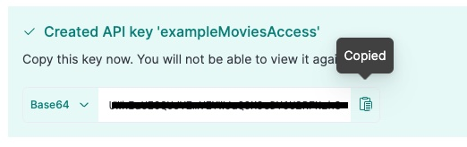
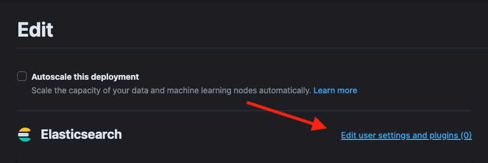
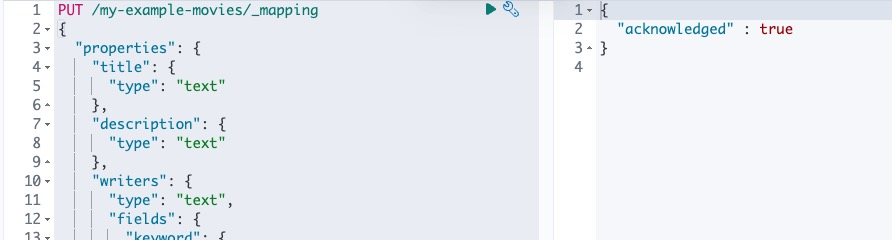

<DocCallOut color="warning" title="Technical preview">
Elasticsearch connector for Search UI is currently in technical preview status. It is not ready for production use.
</DocCallOut>

This tutorial will guide you through the process of creating a Search UI with Elasticsearch directly, using the `elasticsearch-connector`. We will be using a sample movie data-set of around 1000 movies.

Within this tutorial, we assume that you have Node.js installed on your machine.

## Step 1: Setup Elasticsearch

First we need to setup Elasticsearch. The easiest way to do this is to create an Elasticsearch instance via [Elastic Cloud](https://cloud.elastic.co/registration).

### Setting up an Index

We are going to issue commands via [Kibana's dev tools console](https://www.elastic.co/guide/en/kibana/current/console-kibana.html). You can alternatively use a REST client like Postman to achieve this.

First we need to create an index for our data. We can do this simply via the following request:

```shell
PUT /my-example-movies
```


Elasticsearch will acknowledge our request in the response.

### Setting up a read-only API Key

Next we need to setup an API key to access the data from the index. We can do this via Kibana's Stack Management API Keys page (`<your Kibana endpoint>/app/management/security/api_keys`). Note that security needs to be enabled for this option to be available.

Notice here we are only giving read privileges for this api key. You will need to setup an api key with write privileges to add and update data to the index.

```json
{
  "superuser": {
    "cluster": ["all"],
    "indices": [
      {
        "names": ["my-example-movies"],
        "privileges": ["read"],
        "allow_restricted_indices": false
      }
    ]
  }
}
```


Once saved, you are presented with the api-key. Copy this and keep it safe. We will need to use this further down in the tutorial.



### Enabling CORS

If you're going to be accessing Elasticsearch directly from a browser and the Elasticsearch host domain doesn't match your site's domain, you will need to enable CORS.

CORS is a browser mechanism which enables controlled access to resources located outside of the current domain. In order for the browser to make requests to Elasticsearch, CORS configuration headers need to specified in the Elasticsearch configuration.



You can do this in cloud by going to the deployment settings for your Elasticsearch instance, click "Edit user settings and plugins" and under "user settings", add the CORS configuration below:

```yaml
http.cors.allow-origin: "*"
http.cors.enabled: true
http.cors.allow-credentials: true
http.cors.allow-methods: OPTIONS, HEAD, GET, POST, PUT, DELETE
http.cors.allow-headers: X-Requested-With, X-Auth-Token, Content-Type, Content-Length, Authorization, Access-Control-Allow-Headers, Accept
```


then save. Your Elasticsearch instance will be restarted and the CORS configuration will be active.

## Step 2: Setup Movies Index

Next we need to setup the index fields, ready for us to ingest data.

The mapping for an index depends on the data you want to index and the features you want.

### Examples

We want to be able to search on title. We need only one field of type text.

```json
{
  "properties": {
    "title": {
      "type": "text"
    }
  }
}
```

We want to be able to search and product facets for writers field. We need two fields of different types: keyword and text.

```json
{
  "properties": {
    "writers": {
      "type": "text",
      "fields": {
        "keyword": {
          "type": "keyword"
        }
      }
    }
  }
}
```

We want to be able to filter on a date field. We only need one date field.

```json
{
  "properties": {
    "released": {
      "type": "date"
    }
  }
}
```

We want to be able to filter on a numeric field. We only need one numeric field. Can be a choice of integer, float and [more documented here](https://www.elastic.co/guide/en/elasticsearch/reference/current/number.html)

```json
{
  "properties": {
    "imdbRating": {
      "type": "float"
    }
  }
}
```

For our movie data-set, we will be using the following fields:

- title (searchable)
- plot (searchable)
- genre (searchable, facetable)
- actors (searchable, facetable)
- directors (searchable, facetable)
- released (filterable)
- imdbRating (filterable)

The mapping file will be as follows, and we'll once again use Kibana's dev tools console to update the mapping file for our index.

```shell
PUT /my-example-movies/_mapping
{
  "properties": {
    "title": {
      "type": "text"
    },
    "plot": {
      "type": "text"
    },
    "genre": {
      "type": "text",
      "fields": {
        "keyword": {
          "type": "keyword"
        }
      }
    },
    "actors": {
      "type": "text",
      "fields": {
        "keyword": {
          "type": "keyword"
        }
      }
    },
    "directors": {
      "type": "text",
      "fields": {
        "keyword": {
          "type": "keyword"
        }
      }
    },
    "released": {
      "type": "date"
    },
    "imdbRating": {
      "type": "float"
    }
  }
}
```



Elasticsearch will acknowledge the request in the response.

## Step 3: Index Movies Data

Now with our index and mapping file created, we are ready to index some data! We will use the bulk API to index our data.

We will use the following request. In this example we will be indexing the first movie in the data-set to verify that the data fields is being indexed correctly.

```shell
PUT /my-example-movies/_bulk
{ "index": {}}
{"title": "The Godfather", "released": "1972-03-23T23:00:00.000Z","genre": ["Crime", "Drama"],"directors": ["Francis Ford Coppola"],"actors": ["Marlon Brando", "Al Pacino", "James Caan", "Richard S. Castellano"],"plot": "The aging patriarch of an organized crime dynasty transfers control of his clandestine empire to his reluctant son.","imdbRating": "9.2"}
```

## Step 4: Setup CRA for Search UI

First, download the Search-UI's starter app from github by

```shell
curl https://codeload.github.com/elastic/app-search-reference-ui-react/tar.gz/master | tar -xz
```

and should appear as a folder called `app-search-reference-ui-react-master`.

Navigate to the root to the folder and install the dependencies using the following command:

```shell
yarn
```

### Installing connector

Within the folder, we can now install the `@elastic/search-ui-elasticsearch-connector` library with Yarn.

```shell
yarn add @elastic/search-ui-elasticsearch-connector
```

Make sure to check and update Search UI dependencies to the latest version. You can find the latest version by going to [NPM's page for @elastic/search-ui](https://www.npmjs.com/package/@elastic/search-ui).

### Setting up the connector

Open the project within your favorite editor.

Within `src/App.js`, change line 3 to import the Elasticsearch connector. You no longer need the app-search connector.

```js
import ElasticsearchAPIConnector from "@elastic/search-ui-elasticsearch-connector";
```

and then update the options to the connector

```js
const connector = new ElasticsearchAPIConnector({
  host: "<my-elasticsearch-host>",
  apiKey: "<api-key>",
  index: "my-example-movies"
});
```

If you're using Elastic Cloud, you can find your Elasticsearch host within your deployment's details.


## Step 5: Configure Search UI

Next lets configure Search UI for our needs! Navigate to the config within app.js and update the following:

```js
const config = {
  searchQuery: {
    search_fields: {
      title: {
        weight: 3
      },
      plot: {},
      genre: {},
      actors: {},
      directors: {}
    },
    result_fields: {
      title: {
        snippet: {}
      },
      plot: {
        snippet: {}
      }
    },
    disjunctiveFacets: ["genre.keyword", "actors.keyword", "directors.keyword"],
    facets: {
      "genre.keyword": { type: "value" },
      "actors.keyword": { type: "value" },
      "directors.keyword": { type: "value" },
      released: {
        type: "range",
        ranges: [
          {
            from: "2012-04-07T14:40:04.821Z",
            name: "Within the last 10 years"
          },
          {
            from: "1962-04-07T14:40:04.821Z",
            to: "2012-04-07T14:40:04.821Z",
            name: "10 - 50 years ago"
          },
          {
            to: "1962-04-07T14:40:04.821Z",
            name: "More than 50 years ago"
          }
        ]
      },
      imdbRating: {
        type: "range",
        ranges: [
          { from: 1, to: 3, name: "Pants" },
          { from: 3, to: 6, name: "Mediocre" },
          { from: 6, to: 8, name: "Pretty Good" },
          { from: 8, to: 10, name: "Excellent" }
        ]
      }
    }
  },
  autocompleteQuery: {
    results: {
      resultsPerPage: 5,
      search_fields: {
        title: {
          weight: 3
        },
        plot: {},
        genre: {},
        actors: {},
        directors: {}
      },
      result_fields: {
        title: {
          snippet: {
            size: 100,
            fallback: true
          }
        },
        nps_link: {
          raw: {}
        }
      }
    }
  },
  apiConnector: connector,
  alwaysSearchOnInitialLoad: true
};
```

In the above example, we configured the:

- query fields to search on title, plot, genre, actors and directors using the text fields
- result fields to display title, plot, genre, actors and directors using the text fields
- facets to display genre, actors and directors using the keyword fields
- we made the facets disjunctive for better user experience. The user can select more than one facet to expand their search.
- autocomplete results to suggest results with the same query fields as main search + returning some fields for display.

### Updating Components

We are going to do several steps here:

- update the `<Searchbox />` component to switch off autocomplete
- remove sorting options
- add a `<Facet />` component for each facet field
- update the `<Results />` component to display all the fields

```jsx
<div className="App">
  <ErrorBoundary>
    <Layout
      header={
        <SearchBox
          autocompleteMinimumCharacters={3}
          autocompleteResults={false}
          autocompleteSuggestions={false}
          debounceLength={0}
        />
      }
      sideContent={
        <div>
          {wasSearched && <Sorting label={"Sort by"} sortOptions={[]} />}
          <Facet key={"1"} field={"genre.keyword"} label={"genre"} />
          <Facet key={"2"} field={"actors.keyword"} label={"actors"} />
          <Facet key={"3"} field={"directors.keyword"} label={"directors"} />
          <Facet key={"4"} field={"released"} label={"released"} />
          <Facet key={"4"} field={"imdbRating"} label={"imdb rating"} />
        </div>
      }
      bodyContent={<Results shouldTrackClickThrough={true} />}
      bodyHeader={
        <React.Fragment>
          {wasSearched && <PagingInfo />}
          {wasSearched && <ResultsPerPage />}
        </React.Fragment>
      }
      bodyFooter={<Paging />}
    />
  </ErrorBoundary>
</div>
```

## Step 6: Test Drive!

Lets run the project with the command:

```shell
yarn start
```

and then view the results in the browser at http://localhost:3000/


## Next Steps

Lets recap of the steps we have covered:

- we setup and configured the Elasticsearch index for our data
- we indexed an example movie
- we checked out the starter app and added the Elasticsearch connector
- we configured the Elasticsearch connector to connect to our Elasticsearch index
- we updated the search-ui configuration to specify the fields to be searchable, facetable
- we updated the components to use these fields

Next you can add more data into the index, <DocLink id="guides-customizing-styles-and-html" section="results-component" text="update the results view to display more fields" />, and deploy the app.
