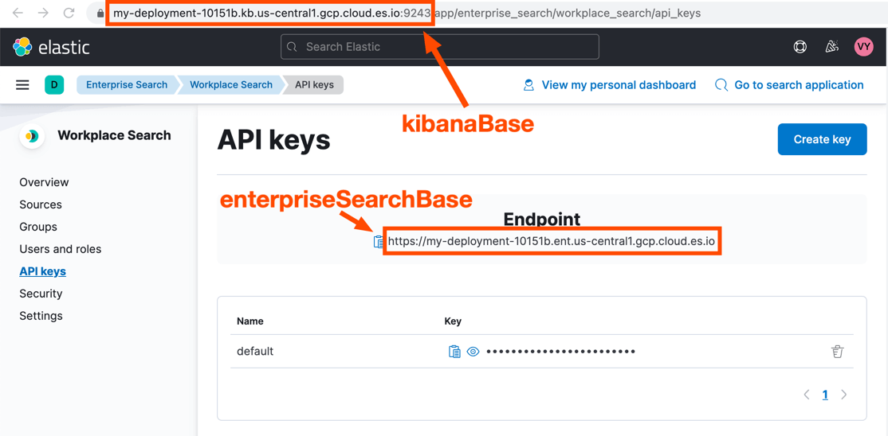
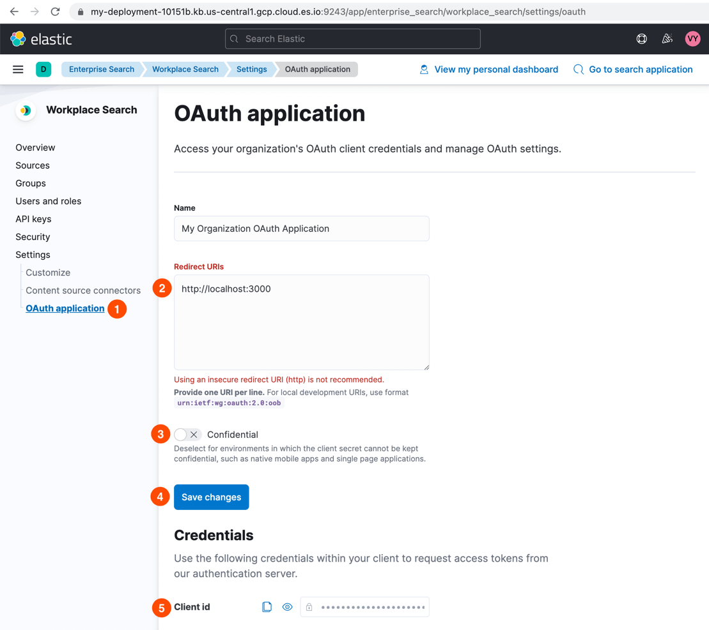

<DocCallOut color="warning" title="Technical preview">
Workplace Search connector for Search UI is currently in technical preview status. It is not ready for production use.
</DocCallOut>

This guide will walk you through getting up and running with a Search UI using [Elastic Workplace Search](https://www.elastic.co/workplace-search/) as a backend.

Have problems with the setup? Let us know in the [feedback issue](https://github.com/elastic/search-ui/issues/707), and we'll try to help.

## Prerequisites

Before continuing with this guide, make sure you:
1) have a running Elastic deployment with Enterprise Search and 
2) indexed some data in Workplace Search.

The best way to get started with Elastic Workplace Search is to follow our [Getting Started guide](https://www.elastic.co/guide/en/workplace-search/current/workplace-search-getting-started.html).

To index data into Workplace Search, read the [Content Sources Overview](https://www.elastic.co/guide/en/workplace-search/current/workplace-search-content-sources.html) and follow a guide for any content source available there. 

## Creating a search page

Have you indexed data into Workplace Search? Great! Let's create a search page in your application.

We'll use React components in this tutorial, but you can use Search UI with any UI framework and even vanilla JavaScript. Read our <DocLink id="guides-philosophy" /> to learn more about using Search UI outside of React.

First, let's install Search UI packages:

```shell
npm install @elastic/react-search-ui @elastic/search-ui-workplace-search-connector
```

Next, create a new page in your application and add the following code:

```jsx
import React from "react";
import WorkplaceSearchAPIConnector from "@elastic/search-ui-workplace-search-connector";
import { SearchProvider, SearchBox, Results, Paging, WithSearch } from "@elastic/react-search-ui";
import { Layout } from "@elastic/react-search-ui-views";
import "@elastic/react-search-ui-views/lib/styles/styles.css";

const connector = new WorkplaceSearchAPIConnector({
  kibanaBase: "",
  enterpriseSearchBase: "",
  redirectUri: "",
  clientId: "",
});

const config = {
  apiConnector: connector,
  alwaysSearchOnInitialLoad: true,
};

export default function WorkplaceSearch() {
  return (
    <SearchProvider config={config}>
      <WithSearch
        mapContextToProps={({ authorizeUrl, isLoggedIn, logout }) => ({
          authorizeUrl,
          isLoggedIn,
          logout,
        })}
      >
        {({ authorizeUrl, isLoggedIn, logout }) => {
          return (
            <div>
              {isLoggedIn ? (
                <button onClick={logout}>Log out</button>
              ) : (
                <a href={authorizeUrl}>Log in</a>
              )}
              <Layout header={<SearchBox />} bodyContent={<Results />} bodyFooter={<Paging />} />
            </div>
          );
        }}
      </WithSearch>
    </SearchProvider>
  );
}
```

This page shouldn't work yet. To connect to the Workplace Search backend, you need to provide some details in the connector configuration.

## Adding connector configuration

Here's where to get the required configuration parameters:

### `kibanaBase` and `enterpriseSearchBase`

You can get both values on the API Keys page in Workplace Search:

- `kibanaBase` — from the url,
- `enterpriseSearchBase` — from the Endpoint panel.



### `redirectUri`

Use the path to the page where Search UI is going to live.

### `clientId`

To get a clientId, you need to create a new OAuth application in Workplace Search.
1. In Workplace Search, go to Settings, then OAuth application.
2. In the Redirect URIs field, add the `redirectUri` value from the previous step.
3. Deselect Confidential toggle.
4. Save changes.
5. Copy the `Client id` from the Credentials section.




After finishing these steps, you should have a configuration that looks something like this:

```js
const connector = new WorkplaceSearchAPIConnector({
  kibanaBase: "https://my-deployment-10151b.kb.us-central1.gcp.cloud.es.io:9243",
  enterpriseSearchBase: "https://my-deployment-10151b.ent.us-central1.gcp.cloud.es.io",
  redirectUri: "http://localhost:3001",
  clientId: "d06a6d2db34ac6f6315cb5e37f84186fa84279371b5fd44186ed84afba14c70e",
});
```

## Authorizing the application

You should now be able to authorize.

Click on the "Log in" link in the Search UI and authorize the application to search your data.


Once you click the Authorize button, you should be redirected back to your application and see the search results.


Congratulations! You have successfully connected to Workplace Search.

## Next steps

The UI we have now is very minimal. That is intentional to get you started quickly.

Some of the next steps you could take to improve your search experience are:

- adding facets,
- adding paging info,
- adding sorting,
- setting up autocomplete
- improving the design of results.

Check out our [example page](https://github.com/elastic/search-ui/blob/7cf8710a8037123ee42dc1616ec8f23b842a66f0/examples/sandbox/src/pages/workplace-search/index.js) where we added some of these items, or follow other guides in this documentation.