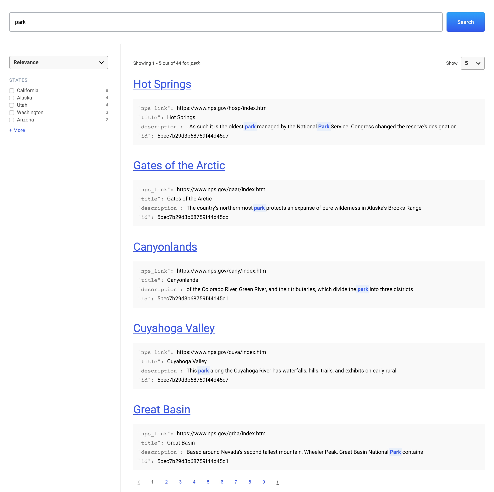

# Search UI: React Framework

Part of the [Search UI](https://github.com/elastic/search-ui) project.

React library for building search experiences.

Uses the [Search UI](../search-ui/README.md).

See the [main README](../../README.md) for set-up instructions.

